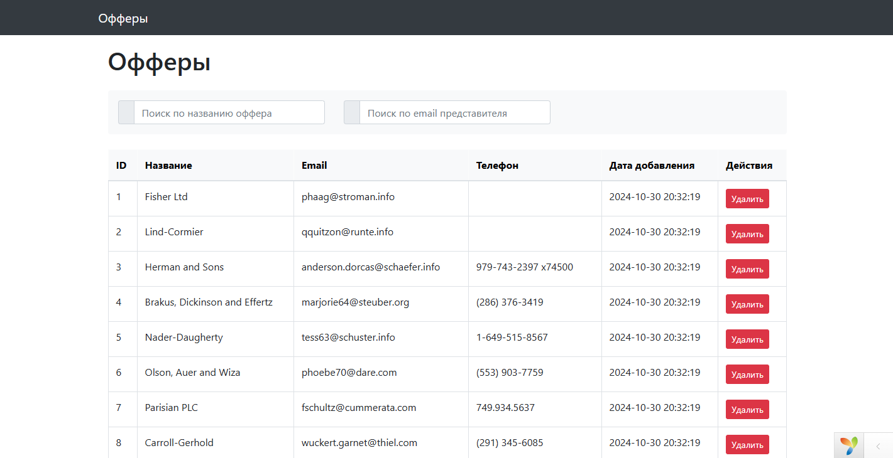
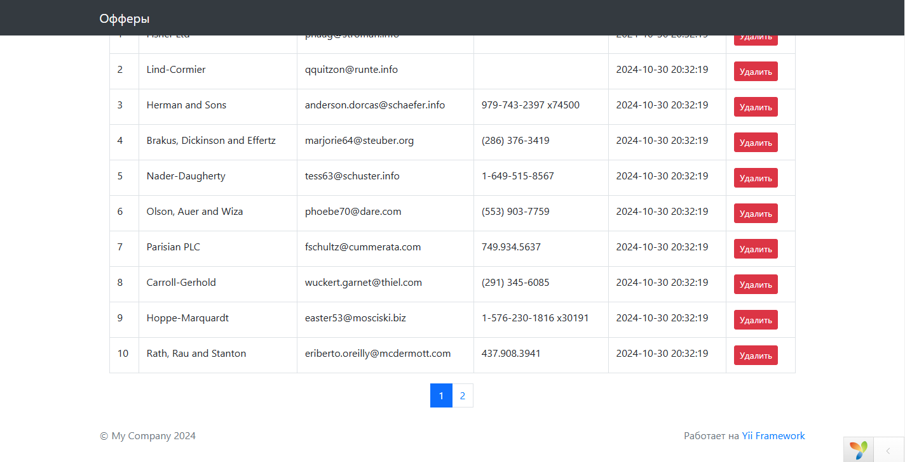
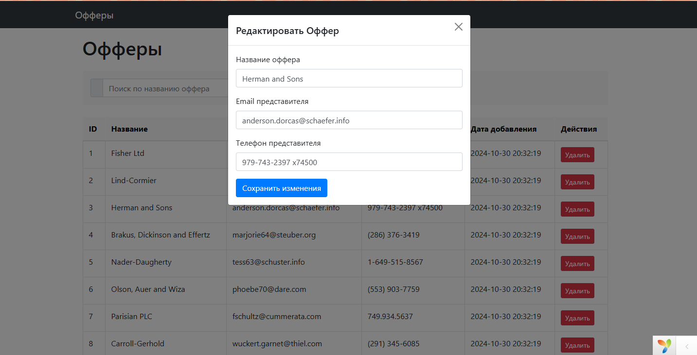

# Установка зависимостей

composer install 

# Установка миграций 

Создать бд и указать ее имя в config/bd.php

yii migrate

# Для заполнения рандомными значениями таблицы 

php yii offer/generate 10

# Запуск проекта

php yii serve --port=8080

# Тестирование

Создать бд c именем "testOffersCRUD_test"

php yii migrate --interactive=0 --appconfig=config/test_migrate.php

php vendor/bin/codecept run

# Скриншоты

